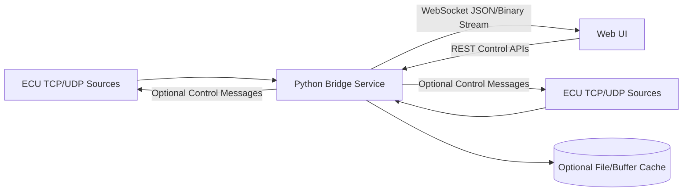

# dlt-viewer Web UI + Python Socket-to-WebSocket Bridge Plan

Date: 2026-06-29

## 1. Objective

Create a web-based UI for live DLT viewing and control, backed by a lightweight Python server that bridges existing socket-based ECU communication (TCP and UDP initially, optional serial later) to WebSocket streams consumable by browsers.

The plan is designed to:

1. Minimize risk by reusing the existing DLT parsing and behavior model from the desktop implementation.
2. Deliver value incrementally with a staged rollout.
3. Keep the Python service lightweight, observable, and production-friendly.

## 2. Current Project Analysis (Relevant Findings)

The current project is a Qt/C++ desktop application with clear separation between core DLT processing and UI.

Key observations:

1. Connection abstraction exists in the core:
   - `qdlt/qdltconnection.*` implements buffer handling and DLT/ascii parsing.
   - `qdlt/qdltipconnection.*` models host/port for IP-based connections.
2. Runtime socket handling is currently in the desktop UI layer:
   - `src/project.h` (`EcuItem`) holds `QTcpSocket`, `QUdpSocket`, and serial state.
   - `src/mainwindow.cpp` handles connect/disconnect/error/readyRead and read loops.
3. Existing behavior already includes:
   - Auto-reconnect timeout handling for TCP/UDP.
   - UDP high-volume burst draining logic.
   - Per-ECU connection state, control flows, and filtering behavior.
4. Architectural docs in `doc/HLD.md` and `doc/LLD.md` confirm threading and pipeline patterns that should be retained in the web version.

Implication for migration:

1. The network session and stream handling currently tied to Qt signals/slots must be re-expressed in Python async I/O.
2. Browser-facing protocol should mirror existing semantics (connection status, message stream, control requests) to reduce functional drift.

## 3. Target Architecture

Core components:

1. Python Bridge Service (lightweight):
   - Async socket clients/listeners for ECU sources.
   - WebSocket broadcast hub for browser clients.
   - REST endpoints for session/control/config management.
   - Optional local spool/log persistence.
2. Web UI:
   - Real-time table/log view.
   - Connection manager and health panel.
   - Filter/search and message details.
   - Optional control actions (GetLogInfo, set levels, etc.).
3. Shared protocol contract:
   - Stable schema for message events, state changes, errors, and stats.

## 4. Technology Recommendation

Python server (lightweight and maintainable):

1. `FastAPI` for REST + WebSocket endpoints.
2. `uvicorn` as ASGI runtime.
3. `asyncio` native tasks and queues.
4. `pydantic` models for strict message schema validation.
5. Optional: `orjson` for low-latency JSON serialization.

Web UI:

1. React + Vite + TypeScript (or Vue + Vite if preferred).
2. Virtualized table component for high throughput.
3. WebSocket client with reconnect/backoff and sequence gap detection.

Reasoning:

1. FastAPI gives simple WebSocket + REST in one service.
2. Asyncio is enough for a lightweight bridge without heavy infrastructure.
3. Typed contracts reduce protocol drift while migrating from desktop behavior.

## 5. Multi-Step Implementation Plan

## Phase 0 - Discovery and Baseline (1 week)

Goals:

1. Freeze a baseline of current desktop behavior for parity tracking.
2. Define non-functional targets.

Tasks:

1. Capture current message throughput from typical ECU traffic (messages/sec, burst size).
2. Document current reconnect behavior for TCP/UDP from `src/mainwindow.cpp`.
3. Define acceptance thresholds:
   - End-to-end latency target (for example <= 250 ms p95 in LAN).
   - Sustained ingestion target (for example >= existing desktop baseline).
   - Recovery target after ECU disconnect.

Outputs:

1. Baseline metrics report.
2. Behavior parity checklist.

## Phase 1 - Protocol and API Contract Design (1 week)

Goals:

1. Define stable browser/server protocol before coding full features.

Tasks:

1. Define WebSocket event envelope:
   - `type`, `timestamp`, `ecu_id`, `seq`, `payload`.
2. Define event types:
   - `message`, `connection_state`, `stats`, `error`, `heartbeat`.
3. Define REST endpoints:
   - `POST /sessions`
   - `POST /sessions/{id}/connect`
   - `POST /sessions/{id}/disconnect`
   - `GET /sessions/{id}/stats`
   - `POST /sessions/{id}/filters`
4. Decide payload mode per channel:
   - JSON decoded message mode (default).
   - Optional binary passthrough mode for advanced clients.

Outputs:

1. Protocol spec markdown.
2. OpenAPI draft.

## Phase 2 - Python Bridge Skeleton (1 week)

Goals:

1. Stand up minimal service with health and WebSocket connectivity.

Tasks:

1. Create service layout under `webbridge/`:
   - `app.py`, `config.py`, `models.py`, `routers/`, `services/`.
2. Implement:
   - `GET /health`
   - `GET /version`
   - `WS /stream/{session_id}`
3. Add structured logging, config loading, and graceful shutdown hooks.
4. Add container/dev run support (`Dockerfile`, `requirements.txt`, make/task scripts).

Outputs:

1. Running local bridge with test WebSocket echo stream.

## Phase 3 - Socket Ingestion Engine (TCP/UDP) (2 weeks)

Goals:

1. Replicate connection lifecycle and data ingestion in Python.

Tasks:

1. Implement TCP client manager:
   - connect, reconnect, backoff, disconnect, state transitions.
2. Implement UDP listener manager:
   - bind, optional multicast join, datagram read loop.
3. Implement per-ECU session state analogous to `EcuItem`:
   - connected/connecting/error, byte counters, reconnect timers.
4. Introduce bounded async queues for backpressure control.
5. Emit connection state events to WebSocket clients.

Outputs:

1. Ingestion service handling multiple ECUs concurrently.
2. Deterministic reconnect behavior tests.

## Phase 4 - DLT Message Framing and Decoding Strategy (2 weeks)

Goals:

1. Produce browser-consumable message events at scale.

Tasks:

1. Decide parser path:
   - Option A: native Python DLT parser library.
   - Option B: lightweight C/C++ helper wrapper around existing parsing logic.
2. Implement framing for TCP stream and UDP datagrams.
3. Normalize message object fields for web clients:
   - time, ecu, apid, ctid, level, payload text/raw, offsets.
4. Add decode failure handling and malformed frame counters.

Outputs:

1. Message stream API with stable schema.
2. Decoder test suite with sample captures.

Decision gate:

1. If pure Python decode does not meet target throughput, switch to hybrid parser wrapper.

## Phase 5 - Web UI MVP (2 weeks)

Goals:

1. Deliver operational live-view parity for core workflows.

Tasks:

1. Build pages:
   - Connections page.
   - Live log stream page.
   - Message detail drawer.
2. Implement WebSocket stream client with automatic reconnect.
3. Add basic filters (ecu/apid/ctid/level text search).
4. Show real-time stats:
   - recv rate, dropped messages, decode errors, client lag.

Outputs:

1. Browser UI able to monitor live ECU streams.

## Phase 6 - Control Operations and Advanced Filters (2 weeks)

Goals:

1. Restore control-plane capabilities from desktop where needed.

Tasks:

1. Implement control API endpoints and command dispatch abstraction.
2. Add server-side filtering pipeline.
3. Add saved filter presets and session presets.
4. Add RBAC-light controls if multi-user deployment is expected.

Outputs:

1. Controlled parity for essential DLT operations.

## Phase 7 - Reliability, Performance, and Security Hardening (1 to 2 weeks)

Goals:

1. Ensure production readiness.

Tasks:

1. Load testing for burst UDP and sustained TCP.
2. Add queue overflow policies:
   - drop oldest, notify clients, preserve service liveness.
3. Add auth mode options:
   - token-based auth for REST/WS.
4. Add origin checks and TLS termination guidance.
5. Add observability:
   - Prometheus metrics endpoint.
   - request/stream tracing IDs.

Outputs:

1. Performance report and hardened deployment profile.

## Phase 8 - Parallel Run and Cutover (1 week)

Goals:

1. Minimize migration risk.

Tasks:

1. Run desktop and web bridge in parallel on same test feeds.
2. Compare:
   - message counts,
   - decode correctness,
   - reconnect behavior,
   - control command outcomes.
3. Fix parity deltas and finalize migration checklist.

Outputs:

1. Cutover readiness sign-off.

## 6. Delivery Milestones

1. M1: Protocol Spec + Skeleton Service.
2. M2: TCP/UDP ingestion + state events.
3. M3: Decoded message stream + Web UI MVP.
4. M4: Control features + hardening.
5. M5: Parallel run complete + production cutover.

## 7. Proposed Repository Additions

1. `webbridge/` (new Python service)
2. `webui/` (new frontend app)
3. `doc/web-protocol.md` (event and API contract)
4. `doc/web-deployment.md` (runtime, security, and ops)
5. `tests/webbridge/` (unit and integration tests)

## 8. Risk Register and Mitigation

1. Throughput bottleneck in Python decode path.
   - Mitigation: benchmark early in Phase 4, support hybrid parser path.
2. Feature parity drift from desktop behavior.
   - Mitigation: maintain parity checklist from Phase 0 and run side-by-side validation.
3. WebSocket client overload under peak bursts.
   - Mitigation: server-side buffering limits + drop policy + client lag telemetry.
4. UDP multicast platform-specific differences.
   - Mitigation: dedicated cross-platform tests for bind/join semantics.
5. Security gaps in initial internal deployment.
   - Mitigation: token auth, origin controls, reverse-proxy TLS baseline before external exposure.

## 9. Test Strategy

1. Unit tests:
   - framing/parsing,
   - reconnect state machine,
   - filter semantics,
   - API model validation.
2. Integration tests:
   - simulated ECU socket feed to WS clients,
   - disconnect/reconnect cycles,
   - malformed packets and recovery.
3. End-to-end tests:
   - browser receives, filters, and displays expected streams.
4. Performance tests:
   - sustained and burst traffic,
   - memory ceiling and CPU profile.

## 10. Acceptance Criteria

1. Web UI displays live DLT messages from TCP and UDP feeds with stable reconnect behavior.
2. Bridge remains responsive under benchmarked peak traffic without unbounded memory growth.
3. Core connection state transitions and message counts are parity-validated against desktop behavior for reference scenarios.
4. Basic control operations and filtering workflows are functional via REST/WS APIs.
5. Observability and security baseline are in place for deployment.

## 11. Recommended Next Action

Start with Phase 0 and Phase 1 immediately, and do not begin full Web UI implementation until the WS event schema and reconnect semantics are signed off.